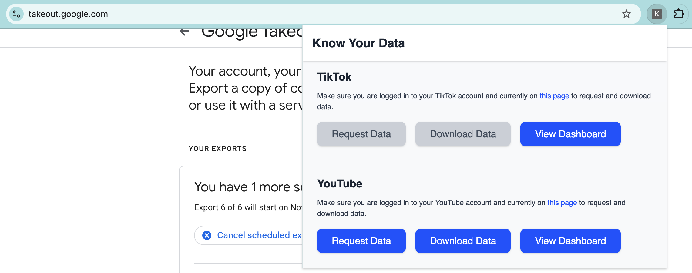
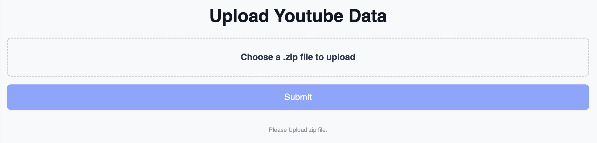
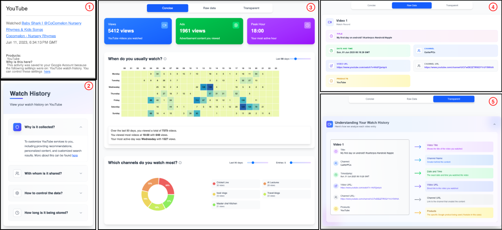

# Know Your Data

## Getting Started

### Prerequisites

Make sure you have [Node.js](https://nodejs.org/) (version 18+ or 20+) installed on your machine.

### Setup

1. Clone or fork the repository :

   ```sh
   # To clone
   git clone https://github.com/saikeerthana00/GDPR_Compliance
   cd GDPR_Compliance/EXTENSION
   ```
2. Install the dependencies:

   ```sh
   npm install
   ```

## Development

To start the development server:

```sh
npm run dev
```

This will start the Vite development server and open your default browser.

## Build

To create a production build:

```sh
npm run build
```

This will generate the build files in the `build` directory.

## Load Extension in Chrome

1. Open Chrome and navigate to `chrome://extensions/`.
2. Enable "Developer mode" using the toggle switch in the top right corner.
3. Click "Load unpacked" and select the `build` directory.

Your React app should now be loaded as a Chrome extension!

## Project Structure

- `public/`: Contains static files and the `manifest.json`.
- `src/`: Contains the React app source code.
- `vite.config.ts`: Vite configuration file.
- `package.json`: Contains the project dependencies and scripts.


## Instructions to Use the Extension

### 1. Requesting and Downloading Data

1. **Log in** to your respective account and make sure you are on the **correct page** as directed in the extension. 
   Refer to the figure below for guidance.
   
2. **Click the “Request Data” button.**  
   Do **not** click anything else unless prompted by the extension or if authentication is required.
3. Once your data request is complete, follow the **same process** for **downloading** the data.

---

### 2. Viewing the Dashboard

1. After downloading, locate the **DDP (Data Download Package)** file — this will be a `.zip` file.  
2. Click on the **“View Dashboard”** button in the extension interface.  
3. **Upload the downloaded `.zip` file** as shown in the figure below.
   
4. The dashboard will automatically process and visualize your data as shown below for the YouTube browsing history.
   

**Figure : ① shows how YouTube currently shares watch history. ② illustrates how our approach addresses some of the
transparency expectations of our survey participants. ③, ④, and ⑤ depict our proposed concise, raw data, and transparent
views respectively.**

