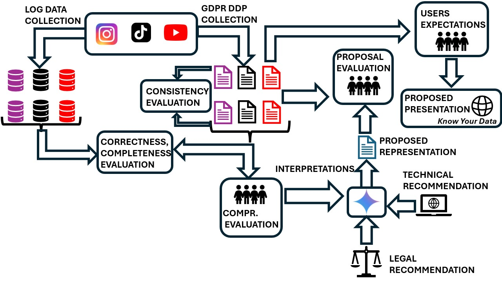

# Setting the Course, but Forgetting to Steer: Analyzing Compliance with GDPR's Right of Access to Data by Instagram, TikTok, and YouTube

Accepted at IEEE S&P 2026.

Sai Keerthana Karnam, Abhisek Dash, Antarish Das, Sepehr Mousavi, Stefan Bechtold, Krishna P. Gummadi, Animesh Mukherjee, Ingmar Weber, Savvas Zannettou. [Arxiv](https://arxiv.org/abs/2502.11208)

---
## Abstract

The GDPR's Right of Access aims to empower users with control over their personal data via Data Download Packages (DDPs). However, their effectiveness is often compromised by inconsistent platform implementations, questionable data reliability, and poor user comprehensibility. This paper conducts a comprehensive audit of DDPs from three social media platforms (TikTok, Instagram, and YouTube) to systematically assess these critical drawbacks. Despite offering similar services, we find that these platforms demonstrate significant inconsistencies in implementing the Right of Access, evident in varying levels of shared data. Critically, the failure to disclose processing purposes, retention periods, and other third-party data recipients serves as a further indicator of non-compliance. Our reliability evaluations, using bots and user-donated data, reveal that while TikTok's DDPs offer more consistent and complete data, others exhibit notable shortcomings. Similarly, our assessment of comprehensibility, based on surveys with 400 participants, indicates that current DDPs substantially fall short of GDPR's standards.
To improve the comprehensibility, we propose and demonstrate a two-layered approach by: (1) enhancing the data representation itself using stakeholder interpretations; and (2) incorporating a user-friendly extension *Know Your Data* for intuitive data visualization where users can control the level of transparency they prefer. Our findings underscore the need for clearer and non-conflicting regulatory guidance, stricter enforcement, and platform commitment to realize the goal of GDPR's Right of Access.



---

## Folder Structure

```
GDPR_Compliance/
│
├── SURVEYS/        # Contains all survey setups.
│   ├── Survey(5)_Comprehensibility.pdf 
│   ├── Survey(5)_DDPs_used.zip
│   ├── Survey(6.1)_improved_DDPs_evaluation.pdf
│   ├── Survey(6.2)_Instagram.pdf
│   ├── Survey(6.2)_TikTok.pdf
│   ├── Survey(6.2)_YouTube.pdf
│
├── PROMPTS/
│   ├── LLM_Prompt_responses(6.1).pdf  # Include the Prompt and Responses from the LLM used for improving comprehensibility.
│
├── EXTENSION/   # Contains the source code for the browser extension developed as part of this project.
│   ├── background.js
│   ├── content.js
│   ├── manifest.json
│   └── ...
│
└── README.md
```

---

## Citation

```
@misc{karnam2025settingcourseforgettingsteer,
      title={Setting the Course, but Forgetting to Steer: Analyzing Compliance with GDPR's Right of Access to Data by Instagram, TikTok, and YouTube}, 
      author={Sai Keerthana Karnam and Abhisek Dash and Sepehr Mousavi and Stefan Bechtold and Krishna P. Gummadi and Animesh Mukherjee and Ingmar Weber and Savvas Zannettou},
      year={2025},
      eprint={2502.11208},
      archivePrefix={arXiv},
      primaryClass={cs.CY},
      url={https://arxiv.org/abs/2502.11208}, 
}
```

## Contact

For any questions or issues, please contact: [saikeerthana00@gmail.com](mailto:saikeerthana00@gmail.com), [adash@mpi-sws.org](mailto:adash@mpi-sws.org)
